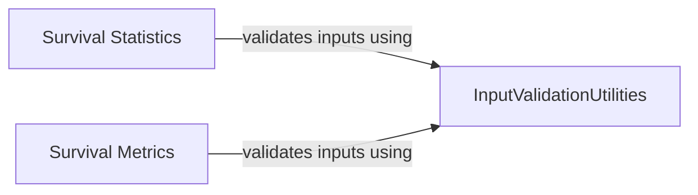

## Component Details

This graph illustrates the core components of a survival analysis library, focusing on statistical computations, model evaluation metrics, and robust input validation. The `Survival Statistics` component provides fundamental statistical tools, while `Survival Metrics` offers various evaluation criteria for survival models. Both of these components rely on `InputValidationUtilities` to ensure the integrity and correctness of input data before processing, preventing errors and ensuring reliable computations.

### Survival Statistics
Provides core statistical functionalities for survival analysis, including Kaplan-Meier estimation for survival and censoring distributions, and Inverse Probability Censoring Weight (IPCW) calculation. These functions are fundamental for understanding survival probabilities and adjusting for censoring in data.

**Related Classes/Methods**:

- <a href="https://github.com/Novartis/torchsurv/blob/master/src/torchsurv/stats/kaplan_meier.py#L10-L253" target="_blank" rel="noopener noreferrer">`torchsurv.src.torchsurv.stats.kaplan_meier.KaplanMeierEstimator` (10:253)</a>
- <a href="https://github.com/Novartis/torchsurv/blob/master/src/torchsurv/stats/ipcw.py#L12-L77" target="_blank" rel="noopener noreferrer">`torchsurv.src.torchsurv.stats.ipcw:get_ipcw` (12:77)</a>

### Survival Metrics
Offers various metrics for evaluating the performance of survival models, such as Concordance Index (C-index), Area Under the Curve (AUC), and Brier Score. These metrics assess different aspects of model prediction accuracy, discrimination, and calibration over time.

**Related Classes/Methods**:

- <a href="https://github.com/Novartis/torchsurv/blob/master/src/torchsurv/metrics/cindex.py#L13-L911" target="_blank" rel="noopener noreferrer">`torchsurv.src.torchsurv.metrics.cindex.ConcordanceIndex` (13:911)</a>
- <a href="https://github.com/Novartis/torchsurv/blob/master/src/torchsurv/metrics/auc.py#L13-L998" target="_blank" rel="noopener noreferrer">`torchsurv.src.torchsurv.metrics.auc.Auc` (13:998)</a>
- <a href="https://github.com/Novartis/torchsurv/blob/master/src/torchsurv/metrics/brier_score.py#L11-L904" target="_blank" rel="noopener noreferrer">`torchsurv.src.torchsurv.metrics.brier_score.BrierScore` (11:904)</a>

### InputValidationUtilities
Contains utility functions for validating input data across the library, ensuring data integrity for survival analysis computations.

**Related Classes/Methods**:

- <a href="https://github.com/Novartis/torchsurv/blob/master/src/torchsurv/tools/validate_inputs.py#L4-L109" target="_blank" rel="noopener noreferrer">`torchsurv.src.torchsurv.tools.validate_inputs` (4:109)</a>

### [FAQ](https://github.com/CodeBoarding/GeneratedOnBoardings/tree/main?tab=readme-ov-file#faq)