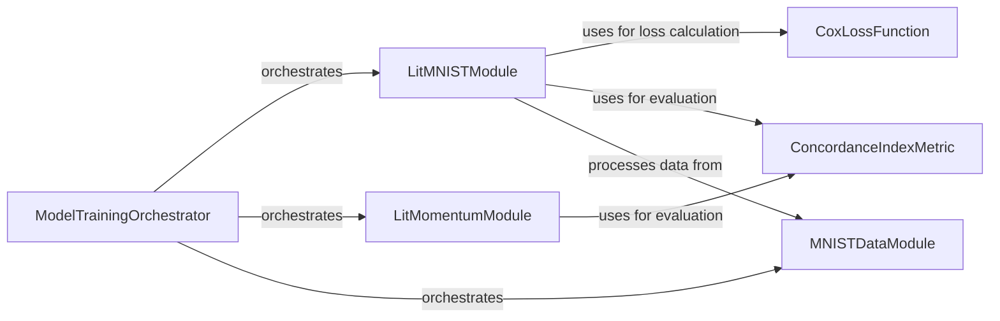

## Component Details

This component overview describes the ModelTraining subsystem, which is responsible for orchestrating the training and evaluation of survival models. It integrates various components for data handling, model optimization, and performance monitoring. The main flow involves preparing data using a DataModule, defining and training models using PyTorch Lightning modules, and evaluating their performance with specific metrics and loss functions.

### ModelTrainingOrchestrator
Orchestrates the training and evaluation of survival models, integrating data handling, optimization, and performance monitoring.

**Related Classes/Methods**:

- <a href="https://github.com/Novartis/torchsurv/blob/master/docs/notebooks/helpers_momentum.py#L10-L73" target="_blank" rel="noopener noreferrer">`torchsurv.docs.notebooks.helpers_momentum.LitMNIST` (10:73)</a>
- <a href="https://github.com/Novartis/torchsurv/blob/master/docs/notebooks/helpers_momentum.py#L76-L127" target="_blank" rel="noopener noreferrer">`torchsurv.docs.notebooks.helpers_momentum.LitMomentum` (76:127)</a>
- <a href="https://github.com/Novartis/torchsurv/blob/master/docs/notebooks/helpers_momentum.py#L130-L183" target="_blank" rel="noopener noreferrer">`torchsurv.docs.notebooks.helpers_momentum.MNISTDataModule` (130:183)</a>

### LitMNISTModule
A PyTorch Lightning module that encapsulates a survival model for the MNIST dataset. It manages the training, validation, and testing loops, utilizing a backbone model, calculating loss with the negative partial log-likelihood, and evaluating performance using the Concordance Index.

**Related Classes/Methods**:

- <a href="https://github.com/Novartis/torchsurv/blob/master/docs/notebooks/helpers_momentum.py#L10-L73" target="_blank" rel="noopener noreferrer">`torchsurv.docs.notebooks.helpers_momentum.LitMNIST` (10:73)</a>

### LitMomentumModule
A PyTorch Lightning module designed for survival models, potentially incorporating momentum-based learning. It handles the training and validation steps, where the internal 'model' (backbone) is responsible for loss computation, and the Concordance Index is used for performance evaluation.

**Related Classes/Methods**:

- <a href="https://github.com/Novartis/torchsurv/blob/master/docs/notebooks/helpers_momentum.py#L76-L127" target="_blank" rel="noopener noreferrer">`torchsurv.docs.notebooks.helpers_momentum.LitMomentum` (76:127)</a>

### MNISTDataModule
A PyTorch Lightning DataModule specifically for the MNIST dataset, responsible for preparing and loading data for training, validation, and testing.

**Related Classes/Methods**:

- <a href="https://github.com/Novartis/torchsurv/blob/master/docs/notebooks/helpers_momentum.py#L130-L183" target="_blank" rel="noopener noreferrer">`torchsurv.docs.notebooks.helpers_momentum.MNISTDataModule` (130:183)</a>

### ConcordanceIndexMetric
A metric component responsible for calculating the Concordance Index (C-index), a widely used measure for assessing the discriminative power of survival models. It provides functionalities for computing confidence intervals and p-values.

**Related Classes/Methods**:

- <a href="https://github.com/Novartis/torchsurv/blob/master/src/torchsurv/metrics/cindex.py#L13-L911" target="_blank" rel="noopener noreferrer">`torchsurv.metrics.cindex.ConcordanceIndex` (13:911)</a>

### CoxLossFunction
A loss function component that computes the negative partial log-likelihood, a standard loss function for Cox proportional hazards models. It supports different methods for handling tied event times, such as Efron's and Breslow's approximations.

**Related Classes/Methods**:

- <a href="https://github.com/Novartis/torchsurv/blob/master/src/torchsurv/loss/cox.py#L10-L168" target="_blank" rel="noopener noreferrer">`torchsurv.loss.cox.neg_partial_log_likelihood` (10:168)</a>

### [FAQ](https://github.com/CodeBoarding/GeneratedOnBoardings/tree/main?tab=readme-ov-file#faq)