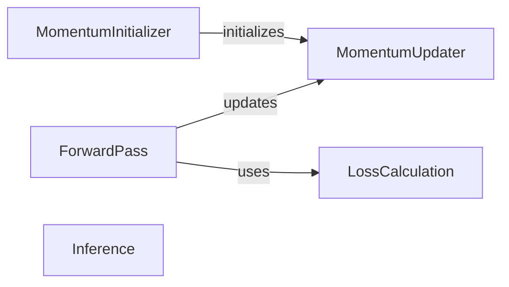

## Component Details

The MomentumTrainingStrategy component provides a robust training approach for survival models by leveraging momentum-based learning. It utilizes an online network for current predictions and a target network, updated via exponential moving average, to provide stable targets. A memory bank is employed to store past features and labels, enabling efficient batch processing and decoupling the training from the immediate batch size. This strategy aims to improve model stability and performance in survival analysis tasks.

### MomentumInitializer
This component is responsible for initializing the Momentum class, setting up the online and target networks, and preparing the data structures for the memory banks. It ensures that the target network's parameters are a copy of the online network's parameters and are not subject to gradient updates.

**Related Classes/Methods**:

- <a href="https://github.com/Novartis/torchsurv/blob/master/src/torchsurv/loss/momentum.py#L60-L121" target="_blank" rel="noopener noreferrer">`torchsurv.src.torchsurv.loss.momentum.Momentum:__init__` (60:121)</a>
- <a href="https://github.com/Novartis/torchsurv/blob/master/src/torchsurv/loss/momentum.py#L210-L213" target="_blank" rel="noopener noreferrer">`torchsurv.src.torchsurv.loss.momentum.Momentum._init_encoder_k` (210:213)</a>

### ForwardPass
This component handles the forward pass of the Momentum model. It computes estimates from the online network, updates the online memory bank, calculates the loss using the combined memory banks, updates the target network using exponential moving average, and finally updates the target memory bank.

**Related Classes/Methods**:

- <a href="https://github.com/Novartis/torchsurv/blob/master/src/torchsurv/loss/momentum.py#L123-L163" target="_blank" rel="noopener noreferrer">`torchsurv.src.torchsurv.loss.momentum.Momentum:forward` (123:163)</a>

### LossCalculation
This component is responsible for computing the loss based on the combined current batch and the memory bank. It uses the specified loss function (e.g., Cox or Weibull) to calculate the negative log-likelihood.

**Related Classes/Methods**:

- <a href="https://github.com/Novartis/torchsurv/blob/master/src/torchsurv/loss/momentum.py#L189-L201" target="_blank" rel="noopener noreferrer">`torchsurv.src.torchsurv.loss.momentum.Momentum._bank_loss` (189:201)</a>

### MomentumUpdater
This component updates the target network's parameters using an exponential moving average (EMA) of the online network's parameters. This mechanism helps in decoupling the batch size during training.

**Related Classes/Methods**:

- <a href="https://github.com/Novartis/torchsurv/blob/master/src/torchsurv/loss/momentum.py#L204-L207" target="_blank" rel="noopener noreferrer">`torchsurv.src.torchsurv.loss.momentum.Momentum._update_momentum_encoder` (204:207)</a>

### Inference
This component provides a method for evaluating data using the target network. It ensures that the target network is in evaluation mode and performs predictions without gradient computation.

**Related Classes/Methods**:

- <a href="https://github.com/Novartis/torchsurv/blob/master/src/torchsurv/loss/momentum.py#L166-L187" target="_blank" rel="noopener noreferrer">`torchsurv.src.torchsurv.loss.momentum.Momentum.infer` (166:187)</a>

### [FAQ](https://github.com/CodeBoarding/GeneratedOnBoardings/tree/main?tab=readme-ov-file#faq)