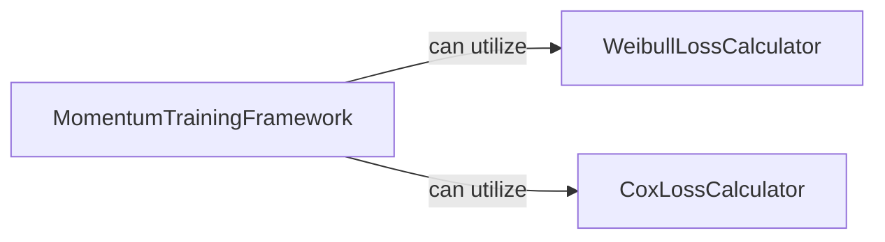

## Component Details

The SurvivalLossFunctions component implements various loss functions crucial for optimizing survival models, including Weibull, Cox, and Momentum-based losses. It provides specialized calculators for Weibull and Cox proportional hazards models, and a training framework that integrates these losses with momentum updates for efficient model training.

### WeibullLossCalculator
This component is responsible for calculating various metrics related to the Weibull Accelerated Time Failure (AFT) survival model, including negative log-likelihood, survival function, log hazard, and cumulative hazard. It also handles input validation and parameter shape adjustments for these calculations.

**Related Classes/Methods**:

- <a href="https://github.com/Novartis/torchsurv/blob/master/src/torchsurv/loss/weibull.py#L8-L120" target="_blank" rel="noopener noreferrer">`torchsurv.src.torchsurv.loss.weibull.neg_log_likelihood` (8:120)</a>
- <a href="https://github.com/Novartis/torchsurv/blob/master/src/torchsurv/loss/weibull.py#L123-L186" target="_blank" rel="noopener noreferrer">`torchsurv.src.torchsurv.loss.weibull.survival_function` (123:186)</a>
- <a href="https://github.com/Novartis/torchsurv/blob/master/src/torchsurv/loss/weibull.py#L189-L260" target="_blank" rel="noopener noreferrer">`torchsurv.src.torchsurv.loss.weibull.log_hazard` (189:260)</a>
- <a href="https://github.com/Novartis/torchsurv/blob/master/src/torchsurv/loss/weibull.py#L263-L315" target="_blank" rel="noopener noreferrer">`torchsurv.src.torchsurv.loss.weibull.cumulative_hazard` (263:315)</a>
- <a href="https://github.com/Novartis/torchsurv/blob/master/src/torchsurv/loss/weibull.py#L338-L363" target="_blank" rel="noopener noreferrer">`torchsurv.src.torchsurv.loss.weibull._check_inputs` (338:363)</a>
- <a href="https://github.com/Novartis/torchsurv/blob/master/src/torchsurv/loss/weibull.py#L318-L335" target="_blank" rel="noopener noreferrer">`torchsurv.src.torchsurv.loss.weibull._check_log_shape` (318:335)</a>

### CoxLossCalculator
This component computes the negative partial log-likelihood for the Cox proportional hazards model. It provides different methods to handle ties in event time, specifically Efron's and Breslow's methods, and includes robust input validation to ensure data integrity.

**Related Classes/Methods**:

- <a href="https://github.com/Novartis/torchsurv/blob/master/src/torchsurv/loss/cox.py#L10-L168" target="_blank" rel="noopener noreferrer">`torchsurv.src.torchsurv.loss.cox.neg_partial_log_likelihood` (10:168)</a>
- <a href="https://github.com/Novartis/torchsurv/blob/master/src/torchsurv/loss/cox.py#L280-L306" target="_blank" rel="noopener noreferrer">`torchsurv.src.torchsurv.loss.cox._check_inputs` (280:306)</a>
- <a href="https://github.com/Novartis/torchsurv/blob/master/src/torchsurv/loss/cox.py#L171-L199" target="_blank" rel="noopener noreferrer">`torchsurv.src.torchsurv.loss.cox._partial_likelihood_cox` (171:199)</a>
- <a href="https://github.com/Novartis/torchsurv/blob/master/src/torchsurv/loss/cox.py#L202-L247" target="_blank" rel="noopener noreferrer">`torchsurv.src.torchsurv.loss.cox._partial_likelihood_efron` (202:247)</a>
- <a href="https://github.com/Novartis/torchsurv/blob/master/src/torchsurv/loss/cox.py#L250-L277" target="_blank" rel="noopener noreferrer">`torchsurv.src.torchsurv.loss.cox._partial_likelihood_breslow` (250:277)</a>

### MomentumTrainingFramework
This component implements a survival training framework that leverages momentum updates to manage and effectively increase the batch size during model training. It utilizes an online network and a target network, where the target network's parameters are updated using an Exponential Moving Average (EMA) of the online network's parameters, and a memory bank is used to pool log hazards for loss calculation.

**Related Classes/Methods**:

- <a href="https://github.com/Novartis/torchsurv/blob/master/src/torchsurv/loss/momentum.py#L10-L213" target="_blank" rel="noopener noreferrer">`torchsurv.src.torchsurv.loss.momentum.Momentum` (10:213)</a>
- <a href="https://github.com/Novartis/torchsurv/blob/master/src/torchsurv/loss/momentum.py#L60-L121" target="_blank" rel="noopener noreferrer">`torchsurv.src.torchsurv.loss.momentum.Momentum.__init__` (60:121)</a>
- <a href="https://github.com/Novartis/torchsurv/blob/master/src/torchsurv/loss/momentum.py#L123-L163" target="_blank" rel="noopener noreferrer">`torchsurv.src.torchsurv.loss.momentum.Momentum.forward` (123:163)</a>
- <a href="https://github.com/Novartis/torchsurv/blob/master/src/torchsurv/loss/momentum.py#L210-L213" target="_blank" rel="noopener noreferrer">`torchsurv.src.torchsurv.loss.momentum.Momentum._init_encoder_k` (210:213)</a>
- <a href="https://github.com/Novartis/torchsurv/blob/master/src/torchsurv/loss/momentum.py#L189-L201" target="_blank" rel="noopener noreferrer">`torchsurv.src.torchsurv.loss.momentum.Momentum._bank_loss` (189:201)</a>
- <a href="https://github.com/Novartis/torchsurv/blob/master/src/torchsurv/loss/momentum.py#L204-L207" target="_blank" rel="noopener noreferrer">`torchsurv.src.torchsurv.loss.momentum.Momentum._update_momentum_encoder` (204:207)</a>

### [FAQ](https://github.com/CodeBoarding/GeneratedOnBoardings/tree/main?tab=readme-ov-file#faq)