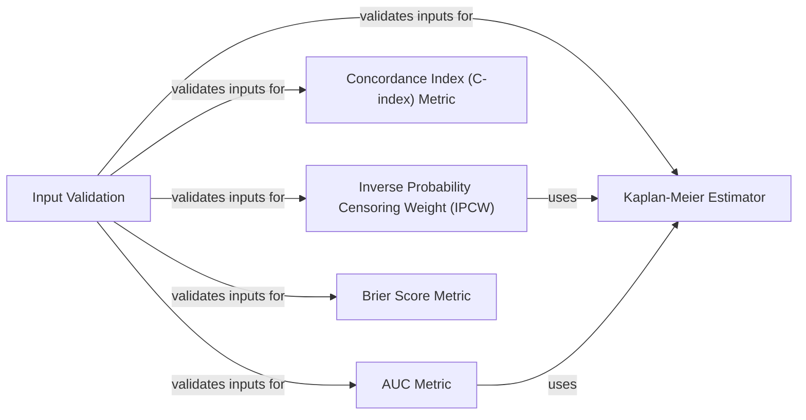

## Component Details

The SurvivalMetricsAndStats component provides a comprehensive suite of statistical methods and performance metrics essential for survival analysis. It encompasses functionalities for estimating survival distributions using the Kaplan-Meier method, handling censored data through Inverse Probability Censoring Weights (IPCW), and evaluating model performance with metrics like Concordance Index (C-index), Area Under the Curve (AUC), and Brier Score. A crucial aspect of this component is its robust input validation, ensuring data integrity across all statistical and metric calculations. The overall flow involves validating input data, applying statistical estimators or metric calculations, and providing various analytical outputs including confidence intervals and p-values where applicable.

### Input Validation
This component is responsible for validating the format and content of input data, specifically survival data (event and time tensors) and estimated risk/survival scores. It ensures data integrity and consistency before further processing by other components.

**Related Classes/Methods**:

- <a href="https://github.com/Novartis/torchsurv/blob/master/src/torchsurv/tools/validate_inputs.py#L4-L38" target="_blank" rel="noopener noreferrer">`torchsurv.src.torchsurv.tools.validate_inputs.validate_survival_data` (4:38)</a>
- <a href="https://github.com/Novartis/torchsurv/blob/master/src/torchsurv/tools/validate_inputs.py#L87-L121" target="_blank" rel="noopener noreferrer">`torchsurv.src.torchsurv.tools.validate_inputs.validate_estimate` (87:121)</a>
- <a href="https://github.com/Novartis/torchsurv/blob/master/src/torchsurv/tools/validate_inputs.py#L41-L84" target="_blank" rel="noopener noreferrer">`torchsurv.src.torchsurv.tools.validate_inputs.validate_evaluation_time` (41:84)</a>

### Kaplan-Meier Estimator
This component implements the Kaplan-Meier estimator, a non-parametric statistic used to estimate the survival function from lifetime data. It can also estimate the censoring distribution. It provides methods for computing the estimate, plotting it, and predicting survival probabilities at new time points.

**Related Classes/Methods**:

- <a href="https://github.com/Novartis/torchsurv/blob/master/src/torchsurv/stats/kaplan_meier.py#L10-L253" target="_blank" rel="noopener noreferrer">`torchsurv.src.torchsurv.stats.kaplan_meier.KaplanMeierEstimator` (10:253)</a>
- <a href="https://github.com/Novartis/torchsurv/blob/master/src/torchsurv/stats/kaplan_meier.py#L13-L93" target="_blank" rel="noopener noreferrer">`torchsurv.src.torchsurv.stats.kaplan_meier.KaplanMeierEstimator.__call__` (13:93)</a>
- <a href="https://github.com/Novartis/torchsurv/blob/master/src/torchsurv/stats/kaplan_meier.py#L127-L178" target="_blank" rel="noopener noreferrer">`torchsurv.src.torchsurv.stats.kaplan_meier.KaplanMeierEstimator.predict` (127:178)</a>
- <a href="https://github.com/Novartis/torchsurv/blob/master/src/torchsurv/stats/kaplan_meier.py#L198-L253" target="_blank" rel="noopener noreferrer">`torchsurv.src.torchsurv.stats.kaplan_meier.KaplanMeierEstimator._compute_counts` (198:253)</a>

### Inverse Probability Censoring Weight (IPCW)
This component calculates the Inverse Probability Censoring Weights (IPCW), which are used to adjust for censoring in survival analysis. It leverages the Kaplan-Meier estimator to determine the censoring distribution and then computes the inverse of this distribution as the weights.

**Related Classes/Methods**:

- <a href="https://github.com/Novartis/torchsurv/blob/master/src/torchsurv/stats/ipcw.py#L12-L77" target="_blank" rel="noopener noreferrer">`torchsurv.src.torchsurv.stats.ipcw.get_ipcw` (12:77)</a>
- <a href="https://github.com/Novartis/torchsurv/blob/master/src/torchsurv/stats/ipcw.py#L80-L104" target="_blank" rel="noopener noreferrer">`torchsurv.src.torchsurv.stats.ipcw._inverse_censoring_dist` (80:104)</a>

### Concordance Index (C-index) Metric
This component computes the Concordance Index (C-index), a measure of the discriminatory power of a survival model. It assesses how well a model predicts the order of events. It supports various methods for confidence interval and p-value calculation, including Noether's method and bootstrapping.

**Related Classes/Methods**:

- <a href="https://github.com/Novartis/torchsurv/blob/master/src/torchsurv/metrics/cindex.py#L13-L911" target="_blank" rel="noopener noreferrer">`torchsurv.src.torchsurv.metrics.cindex.ConcordanceIndex` (13:911)</a>
- <a href="https://github.com/Novartis/torchsurv/blob/master/src/torchsurv/metrics/cindex.py#L63-L253" target="_blank" rel="noopener noreferrer">`torchsurv.src.torchsurv.metrics.cindex.ConcordanceIndex.__call__` (63:253)</a>
- <a href="https://github.com/Novartis/torchsurv/blob/master/src/torchsurv/metrics/cindex.py#L255-L333" target="_blank" rel="noopener noreferrer">`torchsurv.src.torchsurv.metrics.cindex.ConcordanceIndex.confidence_interval` (255:333)</a>
- <a href="https://github.com/Novartis/torchsurv/blob/master/src/torchsurv/metrics/cindex.py#L335-L398" target="_blank" rel="noopener noreferrer">`torchsurv.src.torchsurv.metrics.cindex.ConcordanceIndex.p_value` (335:398)</a>
- <a href="https://github.com/Novartis/torchsurv/blob/master/src/torchsurv/metrics/cindex.py#L400-L470" target="_blank" rel="noopener noreferrer">`torchsurv.src.torchsurv.metrics.cindex.ConcordanceIndex.compare` (400:470)</a>
- <a href="https://github.com/Novartis/torchsurv/blob/master/src/torchsurv/metrics/cindex.py#L472-L506" target="_blank" rel="noopener noreferrer">`torchsurv.src.torchsurv.metrics.cindex.ConcordanceIndex._confidence_interval_noether` (472:506)</a>
- <a href="https://github.com/Novartis/torchsurv/blob/master/src/torchsurv/metrics/cindex.py#L544-L577" target="_blank" rel="noopener noreferrer">`torchsurv.src.torchsurv.metrics.cindex.ConcordanceIndex._confidence_interval_bootstrap` (544:577)</a>
- <a href="https://github.com/Novartis/torchsurv/blob/master/src/torchsurv/metrics/cindex.py#L579-L603" target="_blank" rel="noopener noreferrer">`torchsurv.src.torchsurv.metrics.cindex.ConcordanceIndex._p_value_noether` (579:603)</a>
- <a href="https://github.com/Novartis/torchsurv/blob/master/src/torchsurv/metrics/cindex.py#L605-L628" target="_blank" rel="noopener noreferrer">`torchsurv.src.torchsurv.metrics.cindex.ConcordanceIndex._p_value_bootstrap` (605:628)</a>
- <a href="https://github.com/Novartis/torchsurv/blob/master/src/torchsurv/metrics/cindex.py#L631-L669" target="_blank" rel="noopener noreferrer">`torchsurv.src.torchsurv.metrics.cindex.ConcordanceIndex._compare_noether` (631:669)</a>
- <a href="https://github.com/Novartis/torchsurv/blob/master/src/torchsurv/metrics/cindex.py#L671-L692" target="_blank" rel="noopener noreferrer">`torchsurv.src.torchsurv.metrics.cindex.ConcordanceIndex._compare_bootstrap` (671:692)</a>
- <a href="https://github.com/Novartis/torchsurv/blob/master/src/torchsurv/metrics/cindex.py#L714-L810" target="_blank" rel="noopener noreferrer">`torchsurv.src.torchsurv.metrics.cindex.ConcordanceIndex._bootstrap_cindex` (714:810)</a>
- <a href="https://github.com/Novartis/torchsurv/blob/master/src/torchsurv/metrics/cindex.py#L694-L712" target="_blank" rel="noopener noreferrer">`torchsurv.src.torchsurv.metrics.cindex.ConcordanceIndex._concordance_index_se` (694:712)</a>
- <a href="https://github.com/Novartis/torchsurv/blob/master/src/torchsurv/metrics/cindex.py#L813-L879" target="_blank" rel="noopener noreferrer">`torchsurv.src.torchsurv.metrics.cindex.ConcordanceIndex._get_comparable_and_tied_time` (813:879)</a>
- <a href="https://github.com/Novartis/torchsurv/blob/master/src/torchsurv/metrics/cindex.py#L882-L900" target="_blank" rel="noopener noreferrer">`torchsurv.src.torchsurv.metrics.cindex.ConcordanceIndex._update_weight` (882:900)</a>
- <a href="https://github.com/Novartis/torchsurv/blob/master/src/torchsurv/metrics/cindex.py#L903-L911" target="_blank" rel="noopener noreferrer">`torchsurv.src.torchsurv.metrics.cindex.ConcordanceIndex._update_cindex_estimate` (903:911)</a>

### AUC Metric
This component calculates the Area Under the Curve (AUC) for survival models, a time-dependent metric that evaluates the model's ability to discriminate between subjects who experience an event and those who do not at specific time points. It includes methods for confidence intervals, p-values, and comparisons, with support for bootstrap methods.

**Related Classes/Methods**:

- <a href="https://github.com/Novartis/torchsurv/blob/master/src/torchsurv/metrics/auc.py#L13-L998" target="_blank" rel="noopener noreferrer">`torchsurv.src.torchsurv.metrics.auc.Auc` (13:998)</a>
- <a href="https://github.com/Novartis/torchsurv/blob/master/src/torchsurv/metrics/auc.py#L61-L302" target="_blank" rel="noopener noreferrer">`torchsurv.src.torchsurv.metrics.auc.Auc.__call__` (61:302)</a>
- <a href="https://github.com/Novartis/torchsurv/blob/master/src/torchsurv/metrics/auc.py#L304-L365" target="_blank" rel="noopener noreferrer">`torchsurv.src.torchsurv.metrics.auc.Auc.integral` (304:365)</a>
- <a href="https://github.com/Novartis/torchsurv/blob/master/src/torchsurv/metrics/auc.py#L367-L442" target="_blank" rel="noopener noreferrer">`torchsurv.src.torchsurv.metrics.auc.Auc.confidence_interval` (367:442)</a>
- <a href="https://github.com/Novartis/torchsurv/blob/master/src/torchsurv/metrics/auc.py#L444-L507" target="_blank" rel="noopener noreferrer">`torchsurv.src.torchsurv.metrics.auc.Auc.p_value` (444:507)</a>
- <a href="https://github.com/Novartis/torchsurv/blob/master/src/torchsurv/metrics/auc.py#L509-L579" target="_blank" rel="noopener noreferrer">`torchsurv.src.torchsurv.metrics.auc.Auc.compare` (509:579)</a>
- <a href="https://github.com/Novartis/torchsurv/blob/master/src/torchsurv/metrics/auc.py#L658-L684" target="_blank" rel="noopener noreferrer">`torchsurv.src.torchsurv.metrics.auc.Auc._confidence_interval_blanche` (658:684)</a>
- <a href="https://github.com/Novartis/torchsurv/blob/master/src/torchsurv/metrics/auc.py#L686-L726" target="_blank" rel="noopener noreferrer">`torchsurv.src.torchsurv.metrics.auc.Auc._confidence_interval_bootstrap` (686:726)</a>
- <a href="https://github.com/Novartis/torchsurv/blob/master/src/torchsurv/metrics/auc.py#L728-L752" target="_blank" rel="noopener noreferrer">`torchsurv.src.torchsurv.metrics.auc.Auc._p_value_blanche` (728:752)</a>
- <a href="https://github.com/Novartis/torchsurv/blob/master/src/torchsurv/metrics/auc.py#L754-L784" target="_blank" rel="noopener noreferrer">`torchsurv.src.torchsurv.metrics.auc.Auc._p_value_bootstrap` (754:784)</a>
- <a href="https://github.com/Novartis/torchsurv/blob/master/src/torchsurv/metrics/auc.py#L786-L830" target="_blank" rel="noopener noreferrer">`torchsurv.src.torchsurv.metrics.auc.Auc._compare_blanche` (786:830)</a>
- <a href="https://github.com/Novartis/torchsurv/blob/master/src/torchsurv/metrics/auc.py#L832-L859" target="_blank" rel="noopener noreferrer">`torchsurv.src.torchsurv.metrics.auc.Auc._compare_bootstrap` (832:859)</a>
- <a href="https://github.com/Novartis/torchsurv/blob/master/src/torchsurv/metrics/auc.py#L861-L942" target="_blank" rel="noopener noreferrer">`torchsurv.src.torchsurv.metrics.auc.Auc._auc_se` (861:942)</a>
- <a href="https://github.com/Novartis/torchsurv/blob/master/src/torchsurv/metrics/auc.py#L944-L998" target="_blank" rel="noopener noreferrer">`torchsurv.src.torchsurv.metrics.auc.Auc._integral_censoring_martingale_divided_survival` (944:998)</a>
- `torchsurv.src.torchsurv.metrics.auc.Auc._bootstrap_auc` (full file reference)
- `torchsurv.src.torchsurv.metrics.auc.Auc._update_auc_new_time` (full file reference)
- `torchsurv.src.torchsurv.metrics.auc.Auc._find_torch_unique_indices` (full file reference)
- `torchsurv.src.torchsurv.metrics.auc.Auc._validate_auc_inputs` (full file reference)
- `torchsurv.src.torchsurv.metrics.auc.Auc._update_auc_estimate` (full file reference)
- `torchsurv.src.torchsurv.metrics.auc.Auc._update_auc_weight` (full file reference)
- `torchsurv.src.torchsurv.metrics.auc.Auc._phi_blanche` (full file reference)

### Brier Score Metric
This component computes the Brier Score, a measure of the accuracy of survival predictions at specific time points. It can calculate both the time-dependent and integrated Brier scores and provides methods for confidence interval, p-value, and comparison calculations using parametric and bootstrap approaches.

**Related Classes/Methods**:

- <a href="https://github.com/Novartis/torchsurv/blob/master/src/torchsurv/metrics/brier_score.py#L11-L904" target="_blank" rel="noopener noreferrer">`torchsurv.src.torchsurv.metrics.brier_score.BrierScore` (11:904)</a>
- <a href="https://github.com/Novartis/torchsurv/blob/master/src/torchsurv/metrics/brier_score.py#L57-L222" target="_blank" rel="noopener noreferrer">`torchsurv.src.torchsurv.metrics.brier_score.BrierScore.__call__` (57:222)</a>
- <a href="https://github.com/Novartis/torchsurv/blob/master/src/torchsurv/metrics/brier_score.py#L267-L341" target="_blank" rel="noopener noreferrer">`torchsurv.src.torchsurv.metrics.brier_score.BrierScore.confidence_interval` (267:341)</a>
- <a href="https://github.com/Novartis/torchsurv/blob/master/src/torchsurv/metrics/brier_score.py#L343-L425" target="_blank" rel="noopener noreferrer">`torchsurv.src.torchsurv.metrics.brier_score.BrierScore.p_value` (343:425)</a>
- <a href="https://github.com/Novartis/torchsurv/blob/master/src/torchsurv/metrics/brier_score.py#L427-L497" target="_blank" rel="noopener noreferrer">`torchsurv.src.torchsurv.metrics.brier_score.BrierScore.compare` (427:497)</a>
- <a href="https://github.com/Novartis/torchsurv/blob/master/src/torchsurv/metrics/brier_score.py#L504-L532" target="_blank" rel="noopener noreferrer">`torchsurv.src.torchsurv.metrics.brier_score.BrierScore._confidence_interval_parametric` (504:532)</a>
- <a href="https://github.com/Novartis/torchsurv/blob/master/src/torchsurv/metrics/brier_score.py#L534-L576" target="_blank" rel="noopener noreferrer">`torchsurv.src.torchsurv.metrics.brier_score.BrierScore._confidence_interval_bootstrap` (534:576)</a>
- <a href="https://github.com/Novartis/torchsurv/blob/master/src/torchsurv/metrics/brier_score.py#L578-L606" target="_blank" rel="noopener noreferrer">`torchsurv.src.torchsurv.metrics.brier_score.BrierScore._p_value_parametric` (578:606)</a>
- <a href="https://github.com/Novartis/torchsurv/blob/master/src/torchsurv/metrics/brier_score.py#L608-L640" target="_blank" rel="noopener noreferrer">`torchsurv.src.torchsurv.metrics.brier_score.BrierScore._p_value_bootstrap` (608:640)</a>
- <a href="https://github.com/Novartis/torchsurv/blob/master/src/torchsurv/metrics/brier_score.py#L642-L672" target="_blank" rel="noopener noreferrer">`torchsurv.src.torchsurv.metrics.brier_score.BrierScore._compare_parametric` (642:672)</a>
- <a href="https://github.com/Novartis/torchsurv/blob/master/src/torchsurv/metrics/brier_score.py#L674-L701" target="_blank" rel="noopener noreferrer">`torchsurv.src.torchsurv.metrics.brier_score.BrierScore._compare_bootstrap` (674:701)</a>
- <a href="https://github.com/Novartis/torchsurv/blob/master/src/torchsurv/metrics/brier_score.py#L703-L801" target="_blank" rel="noopener noreferrer">`torchsurv.src.torchsurv.metrics.brier_score.BrierScore._bootstrap_brier_score` (703:801)</a>
- <a href="https://github.com/Novartis/torchsurv/blob/master/src/torchsurv/metrics/brier_score.py#L857-L890" target="_blank" rel="noopener noreferrer">`torchsurv.src.torchsurv.metrics.brier_score.BrierScore._update_brier_score_new_time` (857:890)</a>
- <a href="https://github.com/Novartis/torchsurv/blob/master/src/torchsurv/metrics/brier_score.py#L804-L823" target="_blank" rel="noopener noreferrer">`torchsurv.src.torchsurv.metrics.brier_score.BrierScore._find_torch_unique_indices` (804:823)</a>
- <a href="https://github.com/Novartis/torchsurv/blob/master/src/torchsurv/metrics/brier_score.py#L826-L854" target="_blank" rel="noopener noreferrer">`torchsurv.src.torchsurv.metrics.brier_score.BrierScore._validate_brier_score_inputs` (826:854)</a>
- <a href="https://github.com/Novartis/torchsurv/blob/master/src/torchsurv/metrics/brier_score.py#L893-L904" target="_blank" rel="noopener noreferrer">`torchsurv.src.torchsurv.metrics.brier_score.BrierScore._update_brier_score_weight` (893:904)</a>
- <a href="https://github.com/Novartis/torchsurv/blob/master/src/torchsurv/metrics/brier_score.py#L499-L502" target="_blank" rel="noopener noreferrer">`torchsurv.src.torchsurv.metrics.brier_score.BrierScore._brier_score_se` (499:502)</a>

### [FAQ](https://github.com/CodeBoarding/GeneratedOnBoardings/tree/main?tab=readme-ov-file#faq)