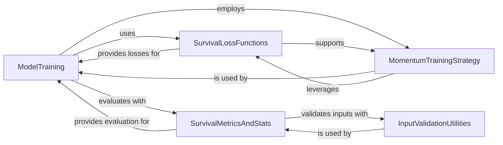

## Component Details

This graph represents the core architecture of `torchsurv`, focusing on the training, evaluation, and statistical analysis of survival models. The main flow involves `ModelTraining` orchestrating the learning process, utilizing `SurvivalLossFunctions` for optimization, `MomentumTrainingStrategy` for advanced training techniques, and `SurvivalMetricsAndStats` for performance evaluation and statistical insights. `InputValidationUtilities` serves as a foundational component, ensuring data integrity across various modules.

### ModelTraining
Orchestrates the training and evaluation of survival models, integrating data handling, optimization, and performance monitoring.

**Related Classes/Methods**:

- <a href="https://github.com/Novartis/torchsurv/blob/master/docs/notebooks/helpers_momentum.py#L10-L73" target="_blank" rel="noopener noreferrer">`torchsurv.docs.notebooks.helpers_momentum.LitMNIST` (10:73)</a>
- <a href="https://github.com/Novartis/torchsurv/blob/master/docs/notebooks/helpers_momentum.py#L76-L127" target="_blank" rel="noopener noreferrer">`torchsurv.docs.notebooks.helpers_momentum.LitMomentum` (76:127)</a>
- <a href="https://github.com/Novartis/torchsurv/blob/master/docs/notebooks/helpers_momentum.py#L130-L183" target="_blank" rel="noopener noreferrer">`torchsurv.docs.notebooks.helpers_momentum.MNISTDataModule` (130:183)</a>

### SurvivalLossFunctions
Implements various loss functions critical for optimizing survival models, including Weibull, Cox, and Momentum-based losses.

**Related Classes/Methods**:

- <a href="https://github.com/Novartis/torchsurv/blob/master/src/torchsurv/loss/weibull.py#L5-L309" target="_blank" rel="noopener noreferrer">`torchsurv.src.torchsurv.loss.weibull` (5:309)</a>
- <a href="https://github.com/Novartis/torchsurv/blob/master/src/torchsurv/loss/cox.py#L6-L269" target="_blank" rel="noopener noreferrer">`torchsurv.src.torchsurv.loss.cox` (6:269)</a>
- <a href="https://github.com/Novartis/torchsurv/blob/master/src/torchsurv/loss/momentum.py#L8-L209" target="_blank" rel="noopener noreferrer">`torchsurv.src.torchsurv.loss.momentum` (8:209)</a>

### MomentumTrainingStrategy
Provides a momentum-based training approach for survival models, utilizing online/target networks and a memory bank for efficient batch processing.

**Related Classes/Methods**:

- <a href="https://github.com/Novartis/torchsurv/blob/master/src/torchsurv/loss/momentum.py#L8-L209" target="_blank" rel="noopener noreferrer">`torchsurv.src.torchsurv.loss.momentum` (8:209)</a>

### SurvivalMetricsAndStats
Offers statistical methods and performance metrics for survival analysis, such as Kaplan-Meier, IPCW, C-index, AUC, and Brier Score.

**Related Classes/Methods**:

- <a href="https://github.com/Novartis/torchsurv/blob/master/src/torchsurv/stats/kaplan_meier.py#L7-L249" target="_blank" rel="noopener noreferrer">`torchsurv.src.torchsurv.stats.kaplan_meier` (7:249)</a>
- <a href="https://github.com/Novartis/torchsurv/blob/master/src/torchsurv/stats/ipcw.py#L8-L100" target="_blank" rel="noopener noreferrer">`torchsurv.src.torchsurv.stats.ipcw` (8:100)</a>
- <a href="https://github.com/Novartis/torchsurv/blob/master/src/torchsurv/metrics/cindex.py#L9-L579" target="_blank" rel="noopener noreferrer">`torchsurv.src.torchsurv.metrics.cindex` (9:579)</a>
- <a href="https://github.com/Novartis/torchsurv/blob/master/src/torchsurv/metrics/auc.py#L4-L209" target="_blank" rel="noopener noreferrer">`torchsurv.src.torchsurv.metrics.auc` (4:209)</a>
- <a href="https://github.com/Novartis/torchsurv/blob/master/src/torchsurv/metrics/brier_score.py#L8-L509" target="_blank" rel="noopener noreferrer">`torchsurv.src.torchsurv.metrics.brier_score` (8:509)</a>

### InputValidationUtilities
Contains utility functions for validating input data across the library, ensuring data integrity for survival analysis computations.

**Related Classes/Methods**:

- <a href="https://github.com/Novartis/torchsurv/blob/master/src/torchsurv/tools/validate_inputs.py#L4-L109" target="_blank" rel="noopener noreferrer">`torchsurv.src.torchsurv.tools.validate_inputs` (4:109)</a>

### [FAQ](https://github.com/CodeBoarding/GeneratedOnBoardings/tree/main?tab=readme-ov-file#faq)