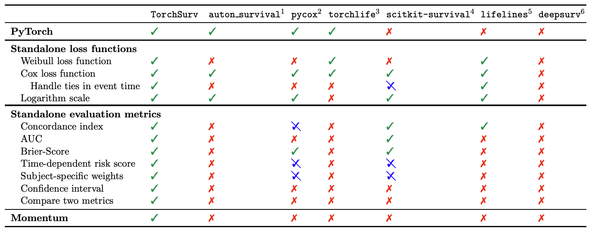

# Deep survival analysis made easy


[](https://pypi.org/project/torchsurv/)
[](https://anaconda.org/conda-forge/torchsurv)
[](https://arxiv.org/abs/2404.10761)
[](https://opensource.nibr.com/torchsurv/)
[](
https://pypi.org/project/torchsurv/)
[](
https://anaconda.org/conda-forge/torchsurv)

`TorchSurv` is a Python package that serves as a companion tool to perform deep survival modeling within the `PyTorch` environment. Unlike existing libraries that impose specific parametric forms on users, `TorchSurv` enables the use of custom `PyTorch`-based deep survival models.  With its lightweight design, minimal input requirements, full `PyTorch` backend, and freedom from restrictive survival model parameterizations, `TorchSurv` facilitates efficient survival model implementation, particularly beneficial for high-dimensional input data scenarios.

## TL;DR

Our idea is to **keep things simple**. You are free to use any model architecture you want! Our code has 100% PyTorch backend and behaves like any other functions (losses or metrics) you may be familiar with.

Our functions are designed to support you, not to make you jump through hoops. Here's a pseudo code illustrating how easy is it to use `TorchSurv` to fit and evaluate a Cox proportional hazards model:

```python
from torchsurv.loss import cox
from torchsurv.metrics.cindex import ConcordanceIndex

# Pseudo training loop
for data in dataloader:
    x, event, time = data
    estimate = model(x)  # shape = torch.Size([64, 1]), if batch size is 64
    loss = cox.neg_partial_log_likelihood(estimate, event, time)
    loss.backward()  # native torch backend

# You can check model performance using our evaluation metrics, e.g, the concordance index with
cindex = ConcordanceIndex()
cindex(estimate, event, time)

# You can obtain the confidence interval of the c-index
cindex.confidence_interval()

# You can test whether the observed c-index is greater than 0.5 (random estimator)
cindex.p_value(method="noether", alternative="two_sided")

# You can even compare the metrics between two models (e.g., vs. model B)
cindex.compare(cindexB)
```

## Installation and dependencies


First, install the package using either [PyPI]([https://pypi.org/](https://pypi.org/project/torchsurv/)) or [Conda]([https://anaconda.org/anaconda/conda](https://anaconda.org/conda-forge/torchsurv))

- Using conda (`recommended`)
```bash
conda install conda-forge::torchsurv
```
- Using PyPI
```bash
pip install torchsurv
```

- Using for local installation (`latest version`)

```bash
git clone <repo>
cd <repo>
pip install -e .
```

Additionally, to build the documentation (`notebooks`, `sphinx`) and for package development (`tests`), please see [the development notes](https://opensource.nibr.com/torchsurv/devnotes.html) and
[dev/environment.yml](dev/environment.yml). This step is **not required** to use `TorchSurv` in your projects but only for optional features.

## Getting started

We recommend starting with the [introductory guide](https://opensource.nibr.com/torchsurv/notebooks/introduction.html), where you'll find an overview of the package's functionalities.

### Survival data

We simulate a random batch of 64 subjects. Each subject is associated with a binary event status (= `True` if event occured), a time-to-event or censoring and 16 covariates.

```python
>>> import torch
>>> _ = torch.manual_seed(52)
>>> n = 64
>>> x = torch.randn((n, 16))
>>> event = torch.randint(low=0, high=2, size=(n,)).bool()
>>> time = torch.randint(low=1, high=100, size=(n,)).float()
```

### Cox proportional hazards model

The user is expected to have defined a model that outputs the estimated *log relative hazard* for each subject. For illustrative purposes, we define a simple linear model that generates a linear combination of the covariates.

```python
>>> from torch import nn
>>> model_cox = nn.Sequential(nn.Linear(16, 1))
>>> log_hz = model_cox(x)
>>> print(log_hz.shape)
torch.Size([64, 1])
```

Given the estimated log relative hazard and the survival data, we calculate the current loss for the batch with:

```python
>>> from torchsurv.loss.cox import neg_partial_log_likelihood
>>> loss = neg_partial_log_likelihood(log_hz, event, time)
>>> print(loss)
tensor(4.1723, grad_fn=<DivBackward0>)
```

We obtain the concordance index for this batch with:

```python
>>> from torchsurv.metrics.cindex import ConcordanceIndex
>>> with torch.no_grad(): log_hz = model_cox(x)
>>> cindex = ConcordanceIndex()
>>> print(cindex(log_hz, event, time))
tensor(0.4872)
```

We obtain the Area Under the Receiver Operating Characteristic Curve (AUC) at a new time t = 50 for this batch with:

```python
>>> from torchsurv.metrics.auc import Auc
>>> new_time = torch.tensor(50.)
>>> auc = Auc()
>>> print(auc(log_hz, event, time, new_time=50))
tensor([0.4737])
```

### Weibull accelerated failure time (AFT) model

The user is expected to have defined a model that outputs for each subject the estimated *log scale* and optionally the *log shape* of the Weibull distribution that the event density follows. In case the model has a single output, `TorchSurv` assume that the shape is equal to 1, resulting in the event density to be an exponential distribution solely parametrized by the scale.

For illustrative purposes, we define a simple linear model that estimate two linear combinations of the covariates (log scale and log shape parameters).

```python
>>> from torch import nn
>>> model_weibull = nn.Sequential(nn.Linear(16, 2))
>>> log_params = model_weibull(x)
>>> print(log_params.shape)
torch.Size([64, 2])
```

Given the estimated log scale and log shape and the survival data, we calculate the current loss for the batch with:

```python
>>> from torchsurv.loss.weibull import neg_log_likelihood
>>> loss = neg_log_likelihood(log_params, event, time)
>>> print(loss)
tensor(82931.5078, grad_fn=<DivBackward0>)
```

To evaluate the predictive performance of the model, we calculate subject-specific log hazard and survival function evaluated at all times with:

```python
>>> from torchsurv.loss.weibull import log_hazard
>>> from torchsurv.loss.weibull import survival_function
>>> with torch.no_grad(): log_params = model_weibull(x)
>>> log_hz = log_hazard(log_params, time)
>>> print(log_hz.shape)
torch.Size([64, 64])
>>> surv = survival_function(log_params, time)
>>> print(surv.shape)
torch.Size([64, 64])
```

We obtain the concordance index for this batch with:

```python
>>> from torchsurv.metrics.cindex import ConcordanceIndex
>>> cindex = ConcordanceIndex()
>>> print(cindex(log_hz, event, time))
tensor(0.4062)
```

We obtain the AUC at a new time t = 50 for this batch with:

```python
>>> from torchsurv.metrics.auc import Auc
>>> new_time = torch.tensor(50.)
>>> log_hz_t = log_hazard(log_params, time=new_time)
>>> auc = Auc()
>>> print(auc(log_hz_t, event, time, new_time=new_time))
tensor([0.3509])
```

We obtain the integrated brier-score with:

```python
>>> from torchsurv.metrics.brier_score import BrierScore
>>> brier_score = BrierScore()
>>> bs = brier_score(surv, event, time)
>>> print(brier_score.integral())
tensor(0.4447)
```

## Related Packages

The table below compares the functionalities of `TorchSurv` with those of
[auton-survival](https://proceedings.mlr.press/v182/nagpal22a.html),
[pycox](http://jmlr.org/papers/v20/18-424.html),
[torchlife](https://sachinruk.github.io/torchlife//index.html),
[scikit-survival](https://jmlr.org/papers/v21/20-729.html),
[lifelines](https://joss.theoj.org/papers/10.21105/joss.01317), and
[deepsurv](https://bmcmedresmethodol.biomedcentral.com/articles/10.1186/s12874-018-0482-1).
While several libraries offer survival modelling functionalities, no existing library provides the flexibility to use a custom PyTorch-based neural networks to define the survival model parameters.

The outputs of both the log-likelihood functions and the evaluation metrics functions have **undergone thorough comparison with benchmarks generated** using `Python` and `R` packages. The comparisons (at time of publication) are summarised in the [Related packages summary](https://opensource.nibr.com/torchsurv/benchmarks.html).




Survival analysis libraries in R. For obtaining the evaluation metrics, packages `survival`, `riskRegression`, `SurvMetrics` and `pec` require the fitted model object as input (a specific object format) and `RisksetROC` imposes a smoothing method. Packages `timeROC`, `riskRegression` and pec force the user to choose a form for subject-specific
weights (e.g., inverse probability of censoring weighting (IPCW)). Packages `survcomp` and `SurvivalROC` do not implement the general AUC but the censoring-adjusted AUC estimator proposed by Heagerty et al. (2000).


## Contributing

We value contributions from the community to enhance and improve this project. If you'd like to contribute, please consider the following:

1. Create Issues: If you encounter bugs, have feature requests, or want to suggest improvements, please create an [issue](https://github.com/Novartis/torchsurv/issues) in the GitHub repository. Make sure to provide detailed information about the problem, including code for reproducibility, or enhancement you're proposing.

2. Fork and Pull Requests: If you're willing to address an existing issue or contribute a new feature, fork the repository, create a new branch, make your changes, and then submit a pull request. Please ensure your code follows our coding conventions and include tests for any new functionality.

By contributing to this project, you agree to license your contributions under the same license as this project.

## Contacts

* [Thibaud Coroller](mailto:thibaud.coroller@novartis.com?subject=TorchSurv) `(creator, maintainer)`
* [Mélodie Monod](mailto:melodie.monod@novartis.com?subject=TorchSurv) `(creator, maintainer)`
* [Peter Krusche](mailto:peter.krusche@novartis.com?subject=TorchSurv) `(author, maintainer)`
* [Qian Cao](mailto:qian.cao@fda.hhs.gov@novartis.com?subject=TorchSurv) `(author, maintainer)`

If you have any questions, suggestions, or feedback, feel free to reach out the developement team [us](https://opensource.nibr.com/torchsurv/AUTHORS.html).

## Cite

If you use this project in academic work or publications, we appreciate citing it using the following BibTeX entry:

```
@misc{monod2024torchsurv,
      title={TorchSurv: A Lightweight Package for Deep Survival Analysis}, 
      author={M{\'{e}}lodie Monod and Peter Krusche and Qian Cao and Berkman Sahiner and Nicholas Petrick and David Ohlssen and Thibaud Coroller},
      year={2024},
      eprint={2404.10761},
      archivePrefix={arXiv},
      primaryClass={cs.LG},
      doi={https://doi.org/10.48550/arXiv.2404.10761}
}
```
