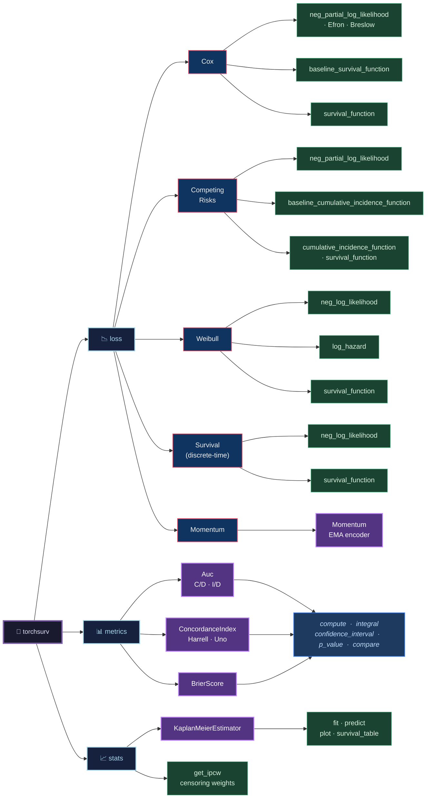

# torchsurv — Package Overview

```mermaid
graph LR
    ROOT["🧬 torchsurv"]:::pkg

    ROOT --> LOSS["📉 loss"]:::mod
    ROOT --> METRICS["📊 metrics"]:::mod
    ROOT --> STATS["📈 stats"]:::mod

    %% LOSS
    LOSS --> COX["Cox"]:::sub
    LOSS --> CR["Competing\nRisks"]:::sub
    LOSS --> WEIBULL["Weibull"]:::sub
    LOSS --> SURVIVAL["Survival\n(discrete-time)"]:::sub
    LOSS --> MOMENTUM["Momentum"]:::sub

    COX --> C1["neg_partial_log_likelihood\n· Efron  · Breslow"]:::fn
    COX --> C2["baseline_survival_function"]:::fn
    COX --> C3["survival_function"]:::fn

    CR --> CR1["neg_partial_log_likelihood"]:::fn
    CR --> CR2["baseline_cumulative_incidence_function"]:::fn
    CR --> CR3["cumulative_incidence_function\n· survival_function"]:::fn

    WEIBULL --> W1["neg_log_likelihood"]:::fn
    WEIBULL --> W2["log_hazard"]:::fn
    WEIBULL --> W3["survival_function"]:::fn

    SURVIVAL --> S1["neg_log_likelihood"]:::fn
    SURVIVAL --> S2["survival_function"]:::fn

    MOMENTUM --> M1["Momentum\nEMA encoder"]:::cls

    %% METRICS
    METRICS --> AUC["Auc\nC/D · I/D"]:::cls
    METRICS --> CI["ConcordanceIndex\nHarrell · Uno"]:::cls
    METRICS --> BS["BrierScore"]:::cls

    AUC & CI & BS --> SHARED["compute  ·  integral\nconfidence_interval  ·  p_value  ·  compare"]:::shared

    %% STATS
    STATS --> KM["KaplanMeierEstimator"]:::cls
    STATS --> IPCW["get_ipcw\ncensoring weights"]:::fn

    KM --> KM1["fit  ·  predict\nplot  ·  survival_table"]:::fn

    classDef pkg    fill:#1a1a2e,color:#e0e0ff,stroke:#7b5ea7,stroke-width:3px,font-size:15px
    classDef mod    fill:#16213e,color:#a8d8ea,stroke:#a8d8ea,stroke-width:2px
    classDef sub    fill:#0f3460,color:#f0f0f0,stroke:#e94560,stroke-width:1.5px
    classDef cls    fill:#533483,color:#fff,stroke:#c084fc,stroke-width:2px
    classDef fn     fill:#1b4332,color:#d8f3dc,stroke:#52b788,stroke-width:1px
    classDef shared fill:#1e3a5f,color:#bfdbfe,stroke:#3b82f6,stroke-width:1.5px,font-style:italic
```
