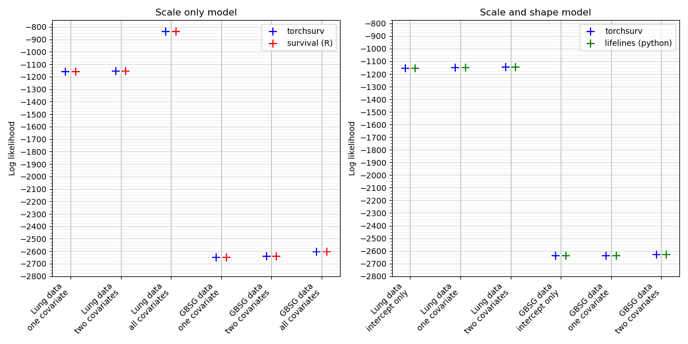
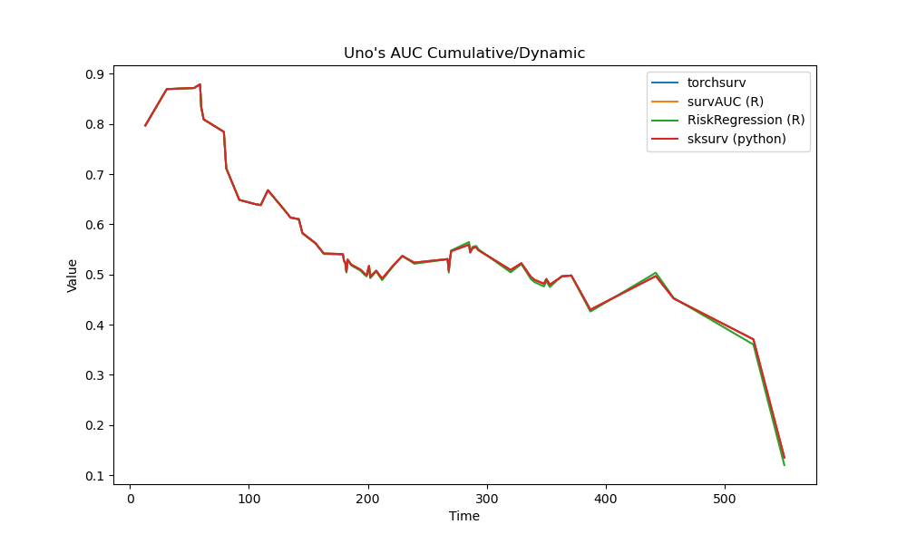
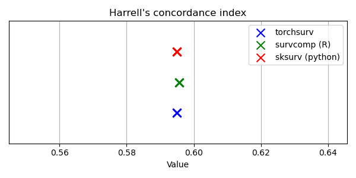
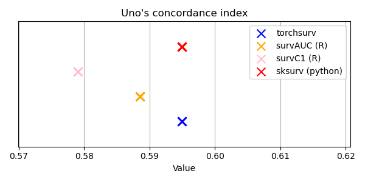
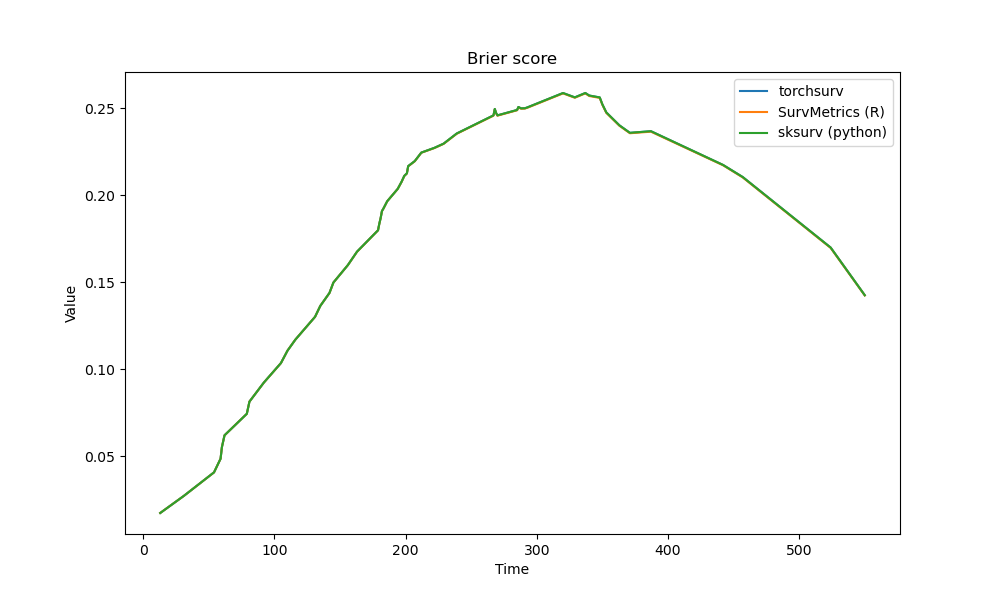

# Related packages

## Structure

Comprehensive tests on API functionalities help maintain their reliability, accuracy, and robustness. Each functionality of the API is thoroughly tested in separate files named `test_$FUNCTIONALITY.py`. The tests cover various aspects:

- **Value Comparison:** The values returned by the functions are compared against benchmarks on real data (e.g., North Central Cancer Treatment Group's [lung dataset](https://lifelines.readthedocs.io/en/latest/lifelines.datasets.html#lifelines.datasets.load_lung) and the German Breast Cancer Study Group [gbsg dataset](https://lifelines.readthedocs.io/en/latest/lifelines.datasets.html#lifelines.datasets.load_gbsg2)) as well as simulated data, including edge cases. This ensures that the functions produce accurate results across different scenarios.

- **Output Format:** The expected format of the function outputs is rigorously tested to ensure consistency and compatibility with other parts of the system or downstream processes.

- **Error Handling:** Input or edge cases that should raise errors are explicitly tested to verify that the functions behave as expected.

## Benchmark Comparison

The values obtained from the unit tests are compared against benchmarks generated using R and Python packages. Below is a table indicating the packages used for benchmarking each functionality:

|  `torchsurv` functionality      | R Package        | Python Package   | File name           |
|---------------------------------|------------------|------------------|---------------------|
| `loss.cox`                      | `survival`       |                / | `tests/test_cox.py` |
| `loss.weibull`                  |  `survival`      |                `lifelines` | `tests/test_weibull.py` |
| `metrics.auc`                   | `survAUC`, `RiskRegression`,  `timeROC`        | `sksurv`         | `tests/test_auc.py` |
| `metrics.cindex`                | `survival`, `survcomp`,  `survAUC`, `survC1`        | `sksurv`         |`tests/test_cindex.py` |
| `metrics.brier_score`           | `survAUC`, `survMetrics`       | `sksurv`         |`tests/test_brier_score.py` |
| `stats.ipcw`           | `pec`       | `sksurv`         |`tests/test_ipcw.py` |
| `stats.kaplan_meier`           | `survival`       | `sksurv`         |`tests/test_kaplan_meier.py` |

## Obtaining Benchmarks on R

Benchmark values from R packages are obtained using R Scripts in `benchmark_script/` and are saved in `benchmark_data/`. Make sure to install the following R libraries before running the scripts:

- `jsonlite`, v.1.8.7
- `survival`, v3.5-7 (2023-08-14)
- `riskRegression`, v.2023.12.21 (2023-12-19)
- `timeROC`, v.0.4 (2019-12-18)
- `survAUC`, v.1.2-0 (2023-03-21)
- `SurvMetrics`, v.0.5.0 (2022-09-03)
- `survcomp`, v.1.52.0 (2023-10-24)
- `survC1`,  v.1.0-3 (2021-02-10)
- `pec`, v.2023.04.12 (2023-04-11)

## Benchmark Comparison Figures

Below are the comparison figures showing the values of the API functionalities against benchmarks generated using different packages:

### `loss.cox`: Partial log likelihood of Cox proportional hazards model

The partial log likelihood of Cox proportional hazards models fitted on two real datasets. Models are parameterized with one, two, or all covariates. The standard Cox partial log likelihood was evaluated using only observations with unique time-to-event (without ties), while Efron's and Breslow's corrections were applied using all observations, accounting for ties in event times.

### `loss.weibull`: Log likelihood of Weibull accelerated failure time (AFT) model

The log likelihood of Weibull Accelerated Failure Time (AFT) models fitted to two real datasets. Models are parameterized with one, two, or all covariates. In the 'scale only' model, only the scale parameter was estimated with a fixed shape, while in the 'shape and scale' model, both the scale and shape parameters were estimated.

### `metrics.auc`: Area Under the Receiver Operating Characteristic Curve (AUC)

Time-dependent Uno's AUC evaluated using the log hazard estimated with a Cox proportional hazards model fitted on the 'lung' dataset. In the unit tests, the AUC evaluated on other model specifications (with one, two, or all covariates) and a second dataset were also compared to this benchmark.

### `metrics.cindex`: Concordance index

Harrell's and Uno's C-index evaluated using the log hazard estimated with a Cox proportional hazards model fitted on the 'lung' dataset. In the unit tests, the C-index evaluated on other model specifications (with one, two, or all covariates) and a second dataset were also compared to this benchmark.

### `metrics.brier_score`: Brier score

Time-dependent Brier score evaluated using the survival function estimated with a Weibull AFT model fitted on the 'lung' dataset. In the unit tests, the Brier score evaluated on other model specifications (with one, two, or all covariates) and a second dataset were also compared to this benchmark.

**_NOTE:_** All three curves are superposed.
